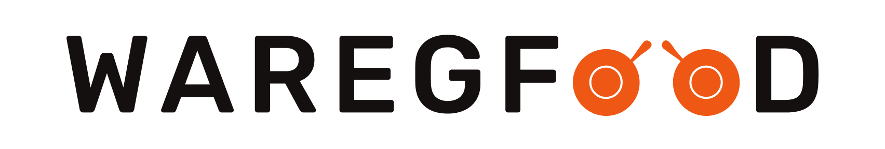

<a name="readme-top"></a>

<div align="center">
  
 
</div>

# 📗 Table of Contents

- [📖 About the Project](#about-project)
  - [🛠 Built With](#built-with)
    - [Tech Stack](#tech-stack)
    - [Key Features](#key-features)
  - [🚀 Live Demo](#live-demo)
- [💻 Getting Started](#getting-started)
  - [Setup](#setup)
  - [Prerequisites](#prerequisites)
  - [Install](#install)
  - [Usage](#usage)
  - [Run tests](#run-tests)
  - [Deployment](#triangular_flag_on_post-deployment)
- [👥 Authors](#authors)
- [🔭 Future Features](#future-features)
- [🤝 Contributing](#contributing)
- [⭐️ Show your support](#support)
- [🔭 Acknowledgements](#acknowledgements)
- [❓ FAQ](#faq)
- [📝 License](#license)

<!-- PROJECT DESCRIPTION -->

# 🎯 Waregfood<a name="about-project"></a>

> We are a technology company first, but with a major focus on consumer well-being through a healthy diet. Most people are very busy with their jobs, family and friends, and other important activities, which doesn't leave much time for cooking. This might lead to a poor diet and lasting health consequences. We want to solve this problem by using an AI-centric approach. Users can use our app to select their diet and foods they like and dislike, and our AI algorithm will create a custom and individual weekly meal plan. But we don't stop there. We partner with restaurants and other cooking partners to actually cook and deliver all meals from the generated meal plans, in selected cities. All this will be packed up in a monthly subscription, where users can choose between receiving one or two meals per day, every single day of the month.

## 🛠 Built With <a name="built-with"></a>

### Tech Stack <a name="tech-stack"></a>

<details>
  <summary>Technology</summary>
  <ul>
    <li>HTML</li>
    <li>CSS</li>
    <li>Javascript</li>
    <li>Webpack</li>
  </ul>
</details>

<details>
  <summary>Tools</summary>
  <ul>
    <li> VS Code</li>
    <li>GIT</li>
    <li>GITHUB</li>
  </ul>
</details>

<!-- Features -->

### Key Sections <a name="key-features"></a>

> This project is a simple food delivery. The main features are:

- **Logo + Navigation**
- **Hero**
- **Featured in**
- **How it works**
- **Meals (and list of diets)**
- **Testimonials + gallery**
- **Pricing + features**
- **CTA**
- **Footer**

<p align="right">(<a href="#readme-top">back to top</a>)</p>

<!-- LIVE DEMO -->

## 👁 Live Demo <a name="live-demo"></a>

- [Live Demo Link](https://shahadat3669.github.io/leaderboard/dist/index.html)

<p align="right">(<a href="#readme-top">back to top</a>)</p>

<!-- GETTING STARTED -->

## 💻 Getting Started <a name="getting-started"></a>

To get a local copy up and running follow these simple example steps.

### Prerequisites

you have to those tools in your local machine.

- [ ] NPM
- [ ] GIT & GITHUB
- [ ] Any Code Editor (VS Code, Brackets, etc)

### Setup

Clone the project.

```bash
  git clone git@github.com:shahadat3669/waregfood
.git
```

Go to the project directory.

```bash
  cd waregfood

```

Now in terminal run `npm install` to install all dependencies.

```bash
  npm install
```

Now in terminal run `npm start` to start the webpack dev server.

```bash
  npm start
```

<p align="right">(<a href="#readme-top">back to top</a>)</p>

<!-- AUTHORS -->

## 👥 Authors <a name="authors"></a>

### First Author:

**Shahadat Hossain**

[](https://github.com/shahadat3669) [](https://linkedin.com/in/shahadat3669) [](https://twitter.com/shahadat3669)

<p align="right">(<a href="#readme-top">back to top</a>)</p>

<!-- CONTRIBUTING -->

## 🤝 Contributing <a name="contributing"></a>

Contributions, issues, and feature requests are welcome!

Feel free to check the [issues page](../../issues/).

<p align="right">(<a href="#readme-top">back to top</a>)</p>

<!-- SUPPORT -->

## 👋 Show your support <a name="support"></a>

Give a ⭐️ if you like this project!

<p align="right">(<a href="#readme-top">back to top</a>)</p>

<!-- ACKNOWLEDGEMENTS -->

## 🔭Acknowledgments <a name="acknowledgements"></a>

- My Family.
<p align="right">(<a href="#readme-top">back to top</a>)</p>

<!-- FAQ (optional) -->

## ❓ FAQ <a name="faq"></a>

- **Are you using database?**

  - No, I am not using any database.

- **Can I use this project for personal use?**

  - Yes, you can use it.

<p align="right">(<a href="#readme-top">back to top</a>)</p>

## 📝 License <a name="license"></a>

This project is [MIT](./LICENSE) licensed.

<p align="right">(<a href="#readme-top">back to top</a>)</p>
